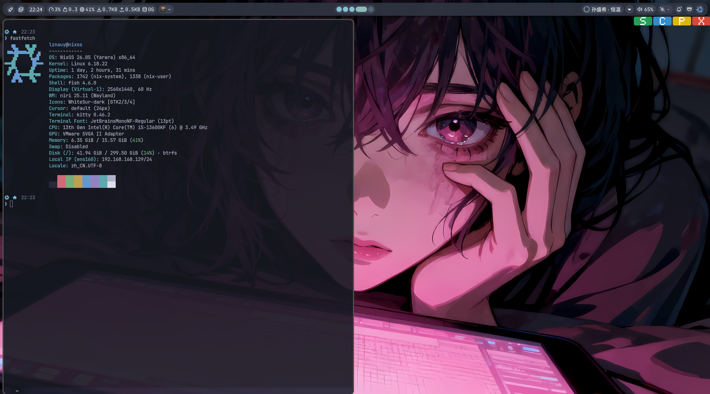

# lznauy's NixOS Flake

我的 NixOS 个人配置，持续完善中。




## 系统概览

- **桌面**: Niri (Wayland 合成器) + Noctalia Shell
- **Shell**: Fish / Zsh
- **编辑器**: Nixvim
- **主题**: Stylix + 自定义 midnight 配色
- **AI 工具**: Claude Code / OpenCode

## 架构设计

### 双机配置

flake.nix 输出两套 `nixosConfigurations`：

- **nixos** — 主机 (VMware 桌面机)，完整桌面环境 + Home Manager
- **vm-k3s** — K3s 集群虚拟机，独立精简配置

两者共享 `hosts/base.nix` 作为公共基础。

### Home Manager 集成

Home Manager 作为 NixOS 模块集成（非独立 flake），用户配置统一在 `home/` 下：

```
home/
├── default.nix        # 入口，汇总所有 packages 和 imports
├── base/              # 基础设施：密钥管理、输入法 (fcitx5)
├── desktop/           # 桌面组件：niri、noctalia、hyprlock、kitty、fuzzel
├── shell/             # Shell 配置：fish、zsh
├── programs/
│   ├── ai/            # AI 工具 + skills/rules 系统
│   ├── devshell/      # 模块化开发环境
│   ├── nixvim/        # Neovim 配置
│   └── apps.nix       # 日常应用
├── xdg/               # XDG 规范：MIME 类型、自启动、桌面文件
└── stylix/            # 主题配置
```

### 模块化开发环境

`devshell/` 按语言拆分为独立模块，通过 `inputsFrom` 组合：

- `base.nix` — 通用工具链
- `python.nix` / `node.nix` / `go.nix` — 语言特定工具

`default.nix` 定义组合矩阵：`default` = 全部，`python`/`node`/`go` = 单语言 + base。

### AI Skills 系统

`programs/ai/` 通过统一的 skills/rules/context 接口同时配置 Claude Code 和 OpenCode，技能定义在 `skills/` 子目录下复用。

### 主题方案

Stylix 采用 `autoEnable = false` 策略，仅对显式声明的目标（kitty、nixvim、fuzzel）生效，避免干扰手动配置的组件（noctalia、hyprlock、starship）。配色支持自定义 YAML 和内置 base16 方案切换。

### 密钥管理

使用 agenix 管理敏感配置，密钥定义在 `secrets/secrets.nix`，主机和用户层分别通过 `hosts/*/secrets.nix` 和 `home/base/secrets.nix` 引用。

## 许可

MIT
